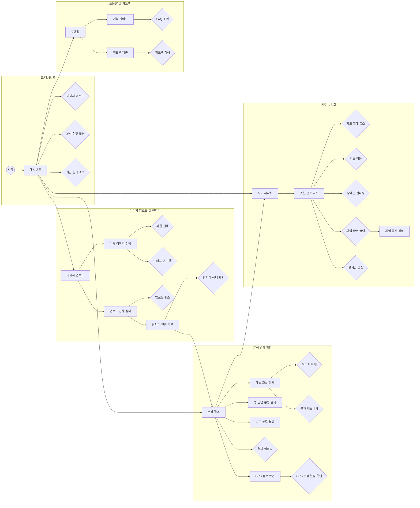

```mermaid
flowchart LR

  subgraph s1 ["홈/대시보드"]
    n1(("시작"))
    n2["대시보드"]
    n3{"이미지 업로드"}
    n4{"분석 현황 확인"}
    n5{"최근 결과 조회"}
  end

  subgraph s2 ["이미지 업로드 및 전처리"]
    n6["이미지 업로드"]
    n7["다중 이미지 선택"]
    n8["업로드 진행 상태"]
    n9{"파일 선택"}
    n10{"드래그 앤 드롭"}
    n11{"업로드 취소"}
    n12["전처리 진행 화면"]
    n13{"전처리 상태 확인"}
  end

  subgraph s3 ["분석 결과 확인"]
    n14["분석 결과"]
    n15["개별 과실 상세"]
    n16["병 감염 분류 결과"]
    n17["숙도 분류 결과"]
    n18{"결과 필터링"}
    n19{"이미지 확대"}
    n20{"결과 내보내기"}
    n21["GPS 정보 확인"]
    n22{"GPS 누락 알림 확인"}
  end

  subgraph s4 ["지도 시각화"]
    n23["지도 시각화"]
    n24["과실 분포 지도"]
    n25{"지도 확대/축소"}
    n26{"지도 이동"}
    n27{"상태별 필터링"}
    n28{"과실 마커 클릭"}
    n29["과실 상세 팝업"]
    n30{"실시간 갱신"}
  end

  subgraph s5 ["도움말 및 피드백"]
    n31["도움말"]
    n32["기능 가이드"]
    n33["피드백 제출"]
    n34{"FAQ 조회"}
    n35{"피드백 작성"}
  end

  n1 --> n2
  n2 --> n3
  n2 --> n4
  n2 --> n5
  n2 --> n6
  n2 --> n14
  n2 --> n23
  n2 --> n31
  n6 --> n7
  n6 --> n8
  n7 --> n9
  n7 --> n10
  n8 --> n11
  n8 --> n12
  n12 --> n13
  n12 --> n14
  n14 --> n15
  n14 --> n16
  n14 --> n17
  n14 --> n18
  n14 --> n21
  n15 --> n19
  n15 --> n20
  n21 --> n22
  n14 --> n23
  n23 --> n24
  n24 --> n25
  n24 --> n26
  n24 --> n27
  n24 --> n28
  n28 --> n29
  n24 --> n30
  n31 --> n32
  n31 --> n33
  n32 --> n34
  n33 --> n35
```
